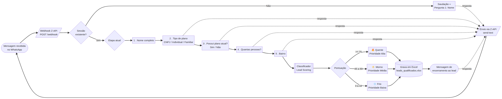

# Bot de Qualificação de Leads — Planos de Saúde (WhatsApp / Z-API)

Bot de qualificação automática de leads de **planos de saúde** para WhatsApp, integrado via **Z-API**. O bot conduz uma conversa estruturada, recolhe as informações do potencial cliente, **classifica o lead** (Quente / Morno / Frio) e grava cada lead numa **planilha Excel** (`.xlsx`).

Faz parte do projeto **Alarion Seguros** e segue o mesmo padrão modular das demais automações em `automacao/`.

---

## Visão Geral do Fluxo



O bot faz, por ordem, as seguintes perguntas:

| # | Pergunta | Campo | Respostas |
|---|----------|-------|-----------|
| 1 | Nome completo | `nome` | Texto livre |
| 2 | Tipo de plano | `tipo_plano` | CNPJ / Individual / Familiar |
| 3 | Possui plano atualmente? | `possui_plano` | Sim / Não |
| 4 | Quantas pessoas | `quantidade_pessoas` | Número |
| 5 | Bairro | `bairro` | Texto livre |

No final, o lead é **classificado** e gravado no ficheiro Excel, e o contacto recebe uma mensagem de encerramento.

---

## Estrutura de Ficheiros

```
automacao/bot-qualificacao/
├── config/
│   ├── fluxo.json            # ⭐ Perguntas, opções e textos (EDITÁVEL)
│   └── classificacao.json    # ⭐ Regras de pontuação e faixas (EDITÁVEL)
├── src/
│   ├── server.js             # Servidor de webhook (recebe mensagens da Z-API)
│   ├── conversa.js           # Motor de conversa (máquina de estados)
│   ├── classificador.js      # Lead scoring (Quente / Morno / Frio)
│   ├── excel.js              # Gravação dos leads em .xlsx
│   ├── zapiClient.js         # Envio de mensagens via Z-API
│   └── logger.js             # Logging com timestamp (horário de Brasília)
├── test/
│   └── simular.js            # Simulação de conversas (sem Z-API)
├── data/                     # Ficheiro Excel gerado (leads_qualificados.xlsx)
├── logs/                     # Logs diários (bot-YYYY-MM-DD.log)
├── fluxo.mmd / fluxo.png     # Diagrama do fluxo
├── .env.example              # Modelo de variáveis de ambiente
├── package.json
└── README.md
```

---

## Como Editar as Perguntas

> As perguntas **não estão no código** — ficam no ficheiro `config/fluxo.json`, para que possa alterá-las facilmente. O bot lê o ficheiro a cada conversa, por isso as alterações entram em vigor sem precisar reiniciar.

Para **alterar um texto**, edite o campo `pergunta` da etapa.
Para **acrescentar/remover uma opção**, edite a lista `opcoes`.
Para **adicionar uma nova pergunta**, acrescente um novo objeto ao array `etapas` com:

```json
{
  "id": "orcamento",
  "campo": "orcamento",
  "tipo": "opcoes",
  "pergunta": "Qual a sua faixa de orçamento mensal?",
  "obrigatorio": true,
  "opcoes": [
    { "valor": "ate_300", "rotulo": "Até R$ 300" },
    { "valor": "300_600", "rotulo": "R$ 300 a R$ 600" },
    { "valor": "acima_600", "rotulo": "Acima de R$ 600" }
  ]
}
```

Tipos de etapa suportados:

| `tipo` | Comportamento |
|--------|---------------|
| `texto` | Aceita texto livre |
| `opcoes` | Mostra lista numerada; aceita o número **ou** o texto da opção |
| `numero` | Aceita apenas números (com `min`/`max` opcionais) |

Se adicionar um novo campo que deva contar para a classificação, lembre-se de o incluir também em `config/classificacao.json` e, se for um campo novo, em `src/classificador.js` e nas colunas de `src/excel.js`.

---

## Como Funciona a Classificação (Lead Scoring)

A pontuação é configurável em `config/classificacao.json`. Por padrão:

**Pontos por resposta**

| Tipo de plano | Pts | | Possui plano | Pts | | Nº de pessoas | Pts |
|---|---|---|---|---|---|---|---|
| CNPJ | 30 | | Sim | 25 | | 1 | 10 |
| Familiar | 20 | | Não | 10 | | 2–3 | 20 |
| Individual | 15 | | | | | 4–9 | 30 |
| | | | | | | 10+ | 40 |

**Faixas de classificação**

| Classificação | Pontuação | Prioridade |
|---|---|---|
| 🔥 Quente | 70 – 100+ | Alta |
| 🌤️ Morno | 45 – 69 | Média |
| ❄️ Frio | 0 – 44 | Baixa |

Ajuste os números livremente conforme a estratégia comercial.

---

## Instalação

```bash
cd automacao/bot-qualificacao
pnpm install            # ou: npm install
cp .env.example .env    # preencha as credenciais da Z-API
```

### Variáveis de Ambiente

| Variável | Obrigatória | Padrão | Descrição |
|---|---|---|---|
| `PORT` | Não | `3100` | Porta do servidor de webhook |
| `WEBHOOK_PATH` | Não | `/webhook` | Caminho do endpoint do webhook |
| `WEBHOOK_TOKEN` | Não | — | Token de segurança exigido na query (`?token=`) |
| `ZAPI_INSTANCE_ID` | **Sim** | — | ID da instância Z-API |
| `ZAPI_INSTANCE_TOKEN` | **Sim** | — | Token da instância Z-API |
| `ZAPI_CLIENT_TOKEN` | Condicional | — | Account Security Token (Client-Token), se ativado no painel |
| `ZAPI_BASE_URL` | Não | `https://api.z-api.io` | Base da API Z-API |
| `SEND_DELAY_MS` | Não | `1200` | Atraso entre mensagens consecutivas |
| `DATA_DIR` | Não | `./data` | Diretório do ficheiro Excel |
| `EXCEL_PATH` | Não | `./data/leads_qualificados.xlsx` | Caminho do ficheiro Excel |
| `SESSAO_TTL_MS` | Não | `21600000` (6h) | Inatividade até reiniciar a conversa |
| `LOG_DIR` | Não | `./logs` | Diretório dos logs |

> **Modo simulação:** se `ZAPI_INSTANCE_ID`/`ZAPI_INSTANCE_TOKEN` não estiverem definidos, o bot funciona normalmente mas **regista** as mensagens em vez de as enviar — ideal para desenvolvimento e testes.

---

## Executar

```bash
pnpm start          # inicia o servidor de webhook (porta 3100)
```

Em produção, recomenda-se um gestor de processos como **PM2**:

```bash
pm2 start src/server.js --name alarion-bot-qualificacao
pm2 save
```

---

## Testar Localmente (sem Z-API)

```bash
pnpm test           # simula 3 conversas completas e gera o Excel em data/
```

Ou teste o webhook via `curl` com o servidor a correr:

```bash
curl -X POST http://localhost:3100/webhook \
  -H "Content-Type: application/json" \
  -d '{"phone":"5511999999999","fromMe":false,"text":{"message":"oi"}}'
```

---

## Configurar a Z-API

1. Crie uma instância em [app.z-api.io](https://app.z-api.io) e ligue o WhatsApp lendo o QR Code.
2. Copie o **ID da instância** e o **Token** para o `.env` (`ZAPI_INSTANCE_ID`, `ZAPI_INSTANCE_TOKEN`).
3. Se tiver o *Account Security Token* ativo, copie-o para `ZAPI_CLIENT_TOKEN`.
4. Exponha o servidor à internet (ex.: domínio próprio, túnel, ou servidor da Alarion) e registe o URL público no painel da Z-API, no webhook **"Ao receber"** (*on-message-received*):
   ```
   https://SEU_DOMINIO/webhook
   ```
   (Se usar `WEBHOOK_TOKEN`, acrescente `?token=SEU_TOKEN` ao URL.)
5. Envie "oi" para o número conectado e a qualificação começa automaticamente.

---

## Saída: Ficheiro Excel

Cada lead finalizado gera uma linha em `data/leads_qualificados.xlsx` com as colunas:

`Data/Hora · Telefone · Nome · Tipo de Plano · Possui Plano Atual · Qtd. Pessoas · Bairro · Pontuação · Classificação · Prioridade`

A célula de **Classificação** é colorida automaticamente (vermelho = Quente, amarelo = Morno, azul = Frio) para facilitar a leitura.

---

## Comandos do Utilizador no WhatsApp

| Comando | Efeito |
|---|---|
| Qualquer mensagem | Inicia a qualificação |
| `reiniciar` / `recomeçar` | Recomeça a qualificação do início |

---

*Alarion Seguros — Automação de Qualificação de Leads.*
